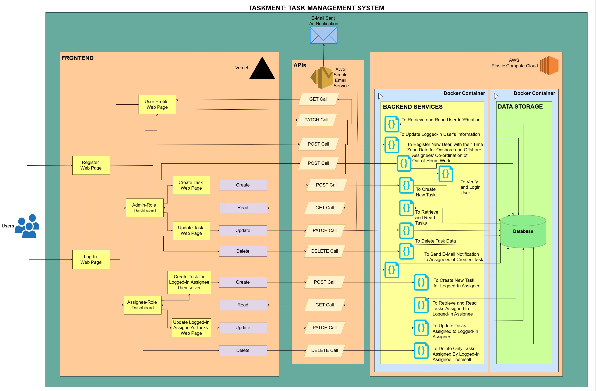
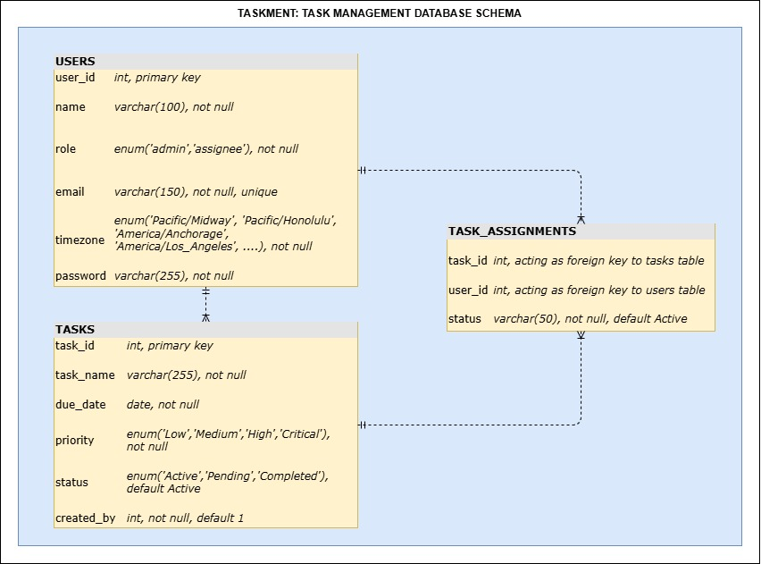
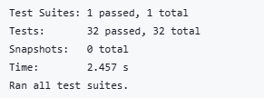
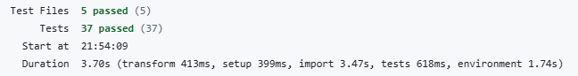

# TaskMent — Task Management Web Application

> **Submission for GetDomus Graduate Full-Stack Developer Technical Assessment**
> Submitted by: Archisa Biswas

---

## Table of Contents

1. [Project Overview](#1-project-overview)
2. [Live Deployment](#2-live-deployment)
3. [System Architecture](#3-system-architecture)
4. [Database Schema](#4-database-schema)
5. [UI Wireframe](#5-ui-wireframe)
6. [Tech Stack Rationale](#6-tech-stack-rationale)
7. [Feature Coverage — Assessment Checklist](#7-feature-coverage--assessment-checklist)
8. [Core Features Deep-Dive](#8-core-features-deep-dive)
   - [Role-Based Access Control](#81-role-based-access-control-rbac)
   - [Task CRUD](#82-task-crud)
   - [Multi-Assignee System](#83-multi-assignee-system)
   - [Timezone Awareness & Working-Hours Logic](#84-timezone-awareness--working-hours-logic)
   - [Stat Cards Logic](#85-stat-cards-logic)
   - [Overdue Task Auto-Detection](#86-overdue-task-auto-detection)
   - [Email Notifications via AWS SES](#87-email-notifications-via-aws-ses)
9. [API Reference](#9-api-reference)
10. [Git Branching Strategy](#10-git-branching-strategy)
11. [CI/CD Pipeline](#11-cicd-pipeline)
12. [Docker & Containerisation](#12-docker--containerisation)
13. [Testing](#13-testing)
14. [Key Design Decisions & Assumptions](#14-key-design-decisions--assumptions)
15. [Getting Started Locally](#15-getting-started-locally)
16. [Project Structure](#16-project-structure)

---

## 1. Project Overview

**TaskMent** is a full-stack task management web application which enables team leads (admins) to create tasks, assign them to multiple onshore and offshore developers, and track progress, all with live timezone awareness in supporting co-ordination and Out-of-Hours work.

## 2. Live Deployment

| Layer | URL / Address | Platform |
|---|---|---|
| Frontend | [https://task-management-web-app-virid.vercel.app/auth/auth2/login](https://task-management-web-app-virid.vercel.app/auth/auth2/login) | Vercel |
| Backend API | `http://18.133.125.0:3000` | AWS EC2 (eu-west-2), within Docker container |
| Database | Internal Docker network | MySQL 8, within Docker container on same EC2 Instance |

The backend and database run as **separate Docker containers on a single EC2 instance**, orchestrated by Docker Compose. The frontend is deployed independently on Vercel; it reaches the EC2 Instance backend via rewrite rules configured in `vercel.json`.

---

## 3. System Architecture

> The following is the System Architecture diagram:

### Request Flow

1. User visits the Vercel URL → React SPA is loaded from the CDN edge
2. App makes a call to `/api/...`
3. Vercel rewrites `/api/*` → `http://18.133.125.0:3000/*` (EC2)
4. Express API on EC2 processes the request and queries the MySQL container
5. On creation of Task and allotment of task assignment, EC2 calls AWS SES to send notification emails to all assignees of that corresponding Task
6. Response returns to the browser and the UI updates

---

## 4. Database Schema

> The following is the Database Schema diagram:

### Key Schema Decisions

| Decision | Rationale |
|---|---|
| Separate `status` per assignment row | Each developer can mark their own work done independently; admin status changes propagate to all rows |
| `ON DELETE CASCADE` on both FK columns | Deleting a task cleans up all assignment rows automatically; referential integrity enforced at DB level |
| IANA timezone string on user | Stored as a string (e.g. `Europe/London`), Daylight Saving Time (DST) transitions are handled automatically by JavaScript's `Intl` feature|

---

## 5. UI Wireframe

> The following is the UI Wireframe that can be accessed through the link below:

[https://canva.link/q36ntp432phba9y](https://canva.link/q36ntp432phba9y)

---

## 6. Tech Stack Rationale

| Layer | Technology | Why chosen |
|---|---|---|
| Frontend framework | React 19 + Vite + TypeScript | For reusable components, effcient rendering, state management, and hot module replacement (HMR) with a fast start-up |
| Styling | Tailwind CSS + Shadcn UI | Utility-first CSS avoids style bloat; Shadcn provides accessible, composable components |
| Tables | TanStack React Table | Headless, fully typed; sorting, filtering, and pagination |
| Routing | React Router v7 | Declarative, supports nested and protected routes |
| Backend framework | Express + TypeScript | Lightweight and, TypeScript enforces contracts between layers |
| Database | MySQL 8 | Relational model fits task/user/assignment naturally; ACID guarantees |
| Email | AWS SES | Allows potential for scaling, with it being a Cloud Service; already inside the AWS ecosystem alongside EC2 |
| Containerisation | Docker + Docker Compose | Reproducible environments; clean separation of backend and DB processes |
| Cloud | AWS EC2 + Vercel | EC2 for stateful services (DB container); Vercel for instant frontend deploys |
| CI/CD | GitHub Actions | Native to GitHub;  built-in secrets management |
| Password hashing | bcrypt (10 rounds) | To follow Security standards
| AI clients | Groq or Google Gemini | Proof-of-concept for future AI features such as task prioritisation, smart assignment suggestions and the like |

---

## 7. Feature Coverage:

### Core Features

| Requirement | Where Implemented |
|---|---|
| Create tasks | `POST /tasks` + `CreateTaskForm.tsx` |
| Read tasks | `GET /assignments`, `GET /my-tasks/:userId` |
| Update tasks | `PATCH /tasks/:taskId`, `PATCH /task-assignments/:taskId/users/:userId` |
| Delete tasks | `DELETE /tasks/:taskId`, `DELETE /task-assignments` |
| Assign tasks to multiple developers | `task_assignments` join table; `POST /task-assignments` |
| Onshore and offshore assignees | Per-user `timezone` field; any IANA zone supported |
| Display each assignee's local time | Real-time clock per assignee, updated every 1 second |
| Avoid out-of-hours contact | Working-hours badge (In-Office / Out-of-Office) per assignee |
| Clear and intuitive dashboard | Separate admin dashboard and user dashboard, stat cards, colour-coded badges |

### Technical Requirements

| Requirement | Implemented |
|---|---|
| System architecture diagram | `/documentation_images/TaskMent___System_Architecture_Diagram.jpg` |
| Frontend | Designed, developed, tested and deployed on Vercel |
| Backend services | Designed, developed, tested and deployed on AWS EC2 Instance in Docker Containers |
| APIs covered | REST endpoints, as documented in Section 9 |
| Data storage covered | MySQL Docker container |
| UI wireframe | [https://canva.link/q36ntp432phba9y](https://canva.link/q36ntp432phba9y) |
| Preferred tech stack | React, TypeScript, Node.js, REST, AWS, MySQL |
| Git with branching strategy | `main` + `dev` branches |
| Deployed to cloud platform | Vercel (frontend) + AWS EC2 (backend + DB) |
| CI/CD practices | GitHub Actions: `ci.yml` + `cd.yml` |
| Containerisation | Docker Compose, with separate backend and database containers |

---

## 8. Core Features

### 8.1 Role-Based Access Control (RBAC)

TaskMent has two roles: **admin** and **assignee**. The role is stored in `users.role` and evaluated on the frontend immediately after login to determine which dashboard and capabilities the user receives.

| Capability | Admin | Assignee |
|---|---|---|
| View all tasks across all users | Yes | No |
| Create new tasks | Yes | Yes |
| Assign tasks to any user | Yes | No |
| Update any task (name, due date, priority, status) | Yes | No |
| Update own task status only | Yes | Yes |
| Delete any task | Yes | No |
| View global stat cards | Yes | No |
| View personal stat cards | No | Yes |
| Access admin dashboard | Yes | No |
| Access assignee dashboard | No | Yes |

---

### 8.2 Task CRUD

**Create**: A deliberate two-step operation:
1. `POST /tasks` creates the task record
2. `POST /task-assignments` immediately assigns it to the creator

This ensures every task always has at least one owner and is never orphaned at creation.

**Read**: Two purpose-built endpoints:
- `GET /assignments`: Returns every task-assignment row joined with user and task data (used by the admin dashboard). The frontend deduplicates rows to build a `coAssignees` array per task.
- `GET /my-tasks/:userId`: Filtered to only tasks where the requesting user is an assignee, with co-assignee info embedded in the response.

**Update (in admin role):** `PATCH /tasks/:taskId` updates `task_name`, `due_date`, `priority`, and/or `status` on the `tasks` table. When `status` is patched, the backend also writes the same value to every matching `task_assignments.status` row for that task, keeping both levels in sync for admin-driven modifications.

**Update (in assignee role):** `PATCH /task-assignments/:taskId/users/:userId` updates only the logged-in assignee's `status` in `task_assignments`. Other assignees and the task record are not touched.

**Delete:**
- `DELETE /tasks/:taskId` removes the task; cascading constraints automatically clean up all assignment rows.
- `DELETE /task-assignments` removes one user from a task. If no assignees remain after removal, the backend also deletes the task itself. Thus, preventing orphaned tasks.

---

### 8.3 Multi-Assignee System

The data model supports **many tasks per user** and **many users per task**, modelled via the `task_assignments` join table.

**Assignment flow:**
1. Admin creates a task (automatically assigned to themselves)
2. Admin assigns additional users via a dropdown (any registered user)
3. `POST /task-assignments` inserts a row for each new assignee
4. AWS SES sends an HTML email to all current assignees notifying them of the assignment

**Co-assignee display:** Every task row on both dashboards shows an avatar cluster of co-assignees. Each avatar expands to show the co-assignee's name, their live local time, and their current working status.

**Cascade on removal:**
- Admin removes any assignee → `DELETE /task-assignments` → if last assignee, task is also deleted

---

### 8.4 Timezone Awareness & Working-Hours Logic

This feature displays each assignee's local time to support coordination and avoid out-of-hours work.

**Data model:** Each user stores a timezone as an IANA zone string (e.g. `Europe/London`, `America/New_York`, `Asia/Kolkata`). A dropdown of 25 IANA zones is presented at registration and on the user profile page to enable a user to update their Local timezone.

**Real-time clock:** The admin dashboard runs a `setInterval` function every **1 second** that recomputes the displayed local time for every assignee using the live browser clock. No API request is made on each tick, instead JavaScript's `Intl.DateTimeFormat` handles the conversion entirely on the client-side.

**Working-hours badge:** A companion function determines whether an assignee is currently within their 9:00 a.m. – 5:00 p.m. window, which is assumed to be the Working Hours window for all assignees.

| Badge | Condition | Visual |
|---|---|---|
| In-Office | Local hour >= 9 and < 17 | Green badge |
| Out-of-Office | Local hour < 9 or >= 17 | Red / grey badge |

The badge is shown **per co-assignee on each task row**, not per task, because developers on the same task across different timezones can be simultaneously in-office and out-of-office.

---

### 8.5 Statistic Cards Logic

The dashboard displays five stat cards. The table below defines what each card signifies, where the data comes from, and how the count is computed.

| Card | Label | What it counts | Data source | Computation rule |
|---|---|---|---|---|
| 1 | All Tasks | All tasks in signifies | `GET /stats` or `GET /stats/user/:userId` | `COUNT(DISTINCT task_id)` across assignments for this scope |
| 2 | Completed | Tasks with status = `Completed` | Same stats endpoint | Filters assignments where `status = 'Completed'` |
| 3 | Pending | Tasks with status = `Pending` | Same stats endpoint | Filters assignments where `status = 'Pending'` |
| 4 | Priority Tasks | High or Critical tasks that are not yet Completed | Same stats endpoint | Filters tasks where `priority IN ('High', 'Critical')` |
| 5 | Non-Priority Tasks | Low or Medium tasks that are not yet Completed | Same stats endpoint | Filters tasks where `priority IN ('Low', 'Medium')` |

**Scope difference by role:**

| Dashboard | Cards reflect | Endpoint called |
|---|---|---|
| Admin (`/dashboard`) | Counts across **all** tasks in the system | `GET /stats` |
| User (`/all-tasks`) | Counts across **only the logged-in assignee's** assigned tasks | `GET /stats/user/:userId` |

**Update frequency:** These Statistics are fetched and re-fetched every time a create, update, or delete action completes. No stale counts are displayed after a modification.

---

### 8.6 Overdue Task Auto-Detection

For both the dashboards, TaskMent checks every loaded task against the current date. Any task that satisfies both conditions:

- `due_date` is strictly before today, **AND**
- `status` is not `Completed`

is automatically patched to `status = 'Pending'` via `PATCH /tasks/:taskId`.

This logic runs:
- **On loading of respective dahsboard**: immediate check when the corresponding dashboard loads
- **Every 60 seconds**: a `setInterval` ensures that if a deadline passes while the page is open, it is caught within one minute without a manual refresh

Note: All Due Dates are assumed to be in GMT.

---

### 8.7 Email Notifications via AWS SES

When a user is assigned to a task, the backend:

1. Fetches all current assignees for the task from the DB
2. Compiles a list of their email addresses
3. Calls `sendTaskAssignmentEmail()` function from `ses-email.ts`
4. AWS SES sends an HTML-formatted email to **all assignees**

**Email content:**
- Task name
- Due date
- Priority level
- Current status
- Full list of co-assignees by name

This keeps the entire team in sync whenever the roster changes.

**AWS SES configuration:**
- Region: `eu-west-2` (co-located with EC2)
- Sender: Verified SES identity (`archisab02@gmail.com`)
- Credentials: Injected via environment variables at container startup. They are not hardcoded in the image

---

## 9. API Reference

The following are the API endpoints in this System:

### Authentication

| Method | Path | Body | Description |
|---|---|---|---|
| `POST` | `/login` | `{ email, password }` | Verify credentials with bcrypt; return user object |
| `POST` | `/register` | `{ name, email, password, timezone }` | Hash password with bcrypt; insert new user |

### Tasks

| Method | Path | Body | Description |
|---|---|---|---|
| `GET` | `/tasks` | — | All tasks (admin use) |
| `POST` | `/tasks` | `{ task_name, due_date, priority, status, created_by }` | Create task; returns `{ taskId }` |
| `PATCH` | `/tasks/:taskId` | `{ task_name?, due_date?, priority?, status? }` | Update task fields + propagate status to all assignees |
| `DELETE` | `/tasks/:taskId` | — | Delete task (cascades all assignment rows) |

### Assignments

| Method | Path | Body | Description |
|---|---|---|---|
| `GET` | `/assignments` | — | All assignments joined with user and task data |
| `POST` | `/task-assignments` | `{ task_id, user_id }` | Assign user to task; triggers SES email |
| `DELETE` | `/task-assignments` | `{ task_id, user_id }` | Remove user from task; delete task if last assignee |
| `PATCH` | `/task-assignments/:taskId/users/:userId` | `{ status }` | Update individual user's status on a task |

### Users

| Method | Path | Body | Description |
|---|---|---|---|
| `GET` | `/users` | — | All users (for assignment dropdown) |
| `PATCH` | `/users/:userId` | `{ name?, email?, timezone? }` | Update user profile fields |
| `GET` | `/my-tasks/:userId` | — | Tasks assigned to this user, with co-assignee info |

### Analytics

| Method | Path | Description |
|---|---|---|
| `GET` | `/stats` | Global task statistics (total, completed, pending, priority counts) |
| `GET` | `/stats/user/:userId` | Same statistics scoped to a single user's assignments |

---

## 10. Git Branching Strategy

TaskMent uses a **two-branch model** to keep in pace for a fast-moving team.

| Branch | Purpose | 
|---|---|
| `main` | Production-ready code; triggers CD deploy to EC2 |
| `dev` | Integration branch; triggers CI |

---

## 11. CI/CD Pipeline

### Continuous Integration: `.github/workflows/ci.yml`

**Triggers:** Push to `dev` or `main`

### Continuous Deployment — `.github/workflows/cd.yml`

**Triggers:** Push to `main` only (after CI passes)

EC2 SSH credentials are stored as **GitHub Actions Secrets**, and not in source code in order to uphold engineering practices.

---

## 12. Docker & Containerisation

Docker Compose defines the backend environment as two named services, backend and db. These definitions are used for the Containers running on the EC2 Instance. Docker Compose also defines the frontend environment, allowing for potential container in a case where a platform such as Vercel may not be being used for the frontend deployment.

### Container Design Decisions

| Decision | Rationale |
|---|---|
| Separate `db` and `backend` containers | Single-responsibility; DB can be upgraded or replaced independently |
| Schema initialised from `db/init.sql` | Schema and seed data are version-controlled; a fresh container always starts from a known state |
| `db` has a healthcheck; `backend` depends on it | Prevents the Express API from starting before MySQL is ready to accept connections |
| Environment variables via `.env` | Keeps secrets out of image layers |

---

## 13. Testing

### Backend Tests: Jest + Supertest

**Location:** `backend/__tests__/app.test.ts`

**Test command:** `cd backend && npm test`

**Dependencies mocked in tests:**
- `mysql2/promise` — mocked pool; tests run without a live DB
- `bcryptjs` — mocked for deterministic password comparisons
- `ses-email.ts` — mocked to prevent real emails firing during test runs

#### Backend Test Results

> The following is the Screenshot of Backend Test Results:

| No. | What it is Testing | Expected Result | Obtained Result |
|-----|--------------------|-----------------|-----------------|
| 1 | `GET /assignments` returns all assignment records | Status 200; array body | Pass |
| 2 | `POST /tasks` creates a task and returns its ID | Status 200; `task_id` present | Pass |
| 3 | `DELETE /tasks/:id` removes task and its assignments | Status 200; both rows deleted | Pass |
| 4 | `PATCH /tasks/:id` updates task fields | Status 200; DB updated with new values | Pass |
| 5 | `POST /login` with valid credentials returns user (no password hash) | Status 200; user object returned | Pass |
| 6 | `POST /login` with wrong password is rejected | Status 401 | Pass |
| 7 | `POST /register` creates a new user | Status 200; `success: true` | Pass |
| 8 | `POST /task-assignments` assigns user and sends SES email | Status 200; SES mock called once | Pass |
| 9 | `PATCH /task-assignments/:taskId/users/:userId` updates one assignee's status | Status 200; `success: true` | Pass |
| 10 | `GET /stats` returns global task counts | Status 200; all count fields correct | Pass |
| 11 | `GET /stats/user/:id` returns task counts scoped to a user | Status 200; scoped counts correct | Pass |

---

### Frontend Tests — Vitest + Testing Library

**Location:** `frontend/package/src/tests/`

**Test command:** `cd frontend/package && npm test`

#### Frontend Test Results

> The following is the Screenshot of Frontend Test Results:

| No. | What it is Testing | Expected Result | Obtained Result |
|-----|--------------------|-----------------|-----------------|
| 1 | `AuthContext.test.tsx`, whether auth state loads from `localStorage`; logout clears state and storage | State initialised; storage cleared on logout | Pass |
| 2 | `AuthLogin.test.tsx`, if empty fields are blocked; valid credentials trigger `POST /login` and navigate | Validation shown; successful login navigates to dashboard | Pass |
| 3 | `CreateTaskForm.test.tsx`, if empty fields blocked; valid submit calls `POST /tasks` then `POST /task-assignments` | Validation shown; both API calls made on valid submit | Pass |
| 4 | `MyTasksTableUtils.test.tsx`, if `getLocalTime()` formats time; `getWorkingStatus()` returns correct badge | Correct time string and in/out-of-office badge | Pass |
| 5 | `ProtectedRoute.test.tsx`, if unauthenticated user redirected; authenticated user sees protected content | Redirect to login; content rendered for auth user | Pass |

---

## 14. Key Design Decisions & Assumptions

### Design Decisions

**1. Dual-status architecture (task-level + assignment-level)**

The `tasks.status` and `task_assignments.status` fields serve distinct purposes. Task-level status is the admin's view of overall progress. Assignment-level status lets each developer track their own work independently. When an admin updates the task status it propagates to all assignee rows. When a developer updates their own status only their row changes. This mirrors how real cross-timezone teams operate.

**2. Frontend on Vercel, backend on EC2**

Vercel provides automatic HTTPS and instant rollbacks. EC2 is necessary for stateful services (MySQL container) and long-running Docker processes, which Vercel's serverless environment cannot host. The split keeps each layer on its optimal platform.

**3. AI clients as proof-of-concept**

`groq-ai.ts` and `gemini-ai.ts` are present in the codebase but not yet wired into the API routes. These could potentially be used for AI-assisted features such as task prioritisation, smart assignment suggestions, natural language task creation, to generate the E-Mail body in sending the E-Mail Notification on Creationg and assignment of a Task, and the like, in the goal of being AI-powered, just like GetDomus.

### Assumptions

- **Working hours are 9:00 a.m. – 5:00 p.m.** in each user's local timezone.
- **Due Dates are all in Greenwich Mean Time (GMT)** for all users of the system.
- **Seed data provides a representative starting state.** Users across multiple timezones and five tasks with assignments are pre-populated via `db/init.sql`.

---

## Thank You
